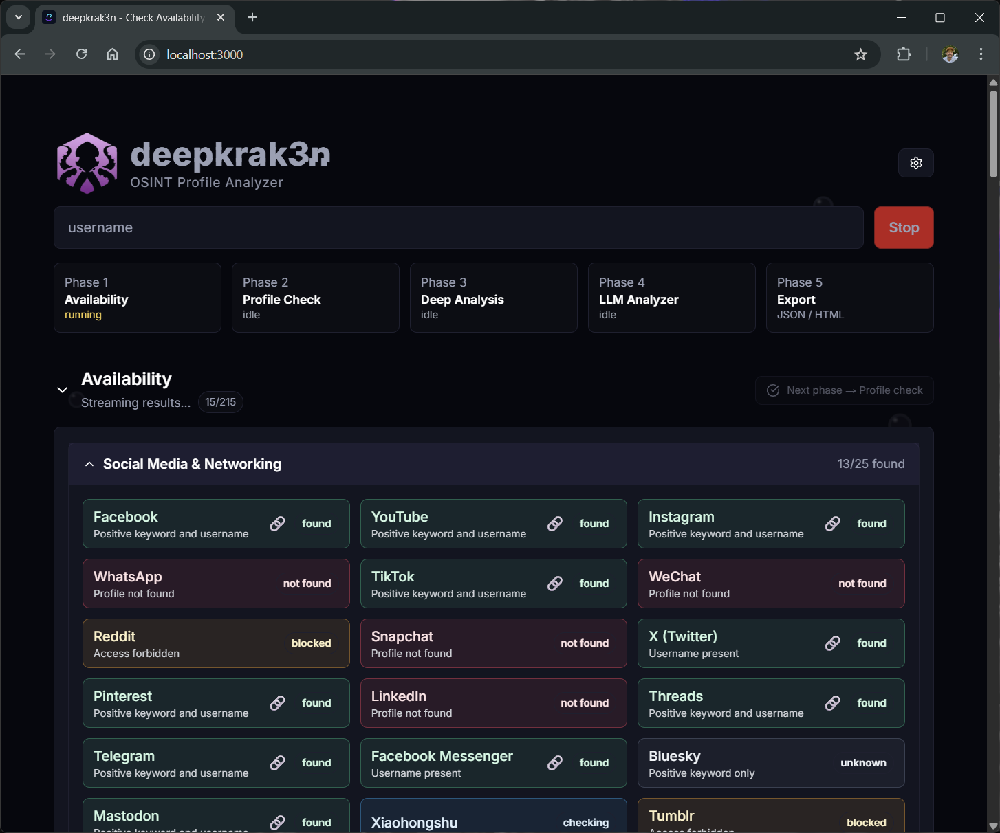
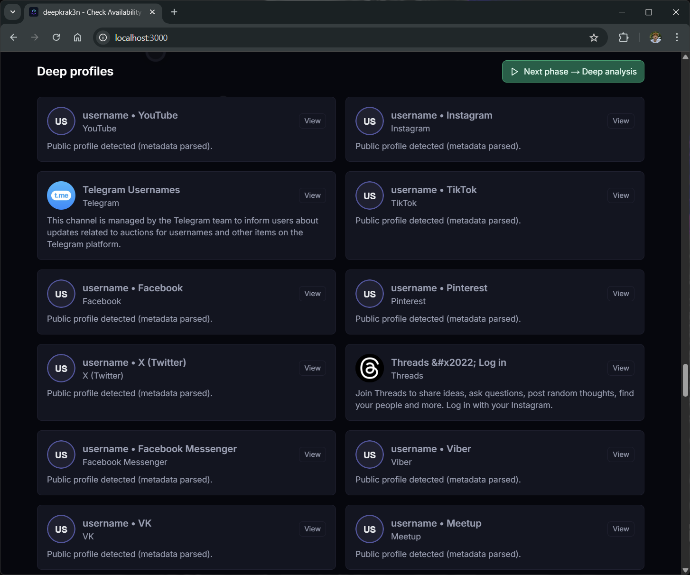
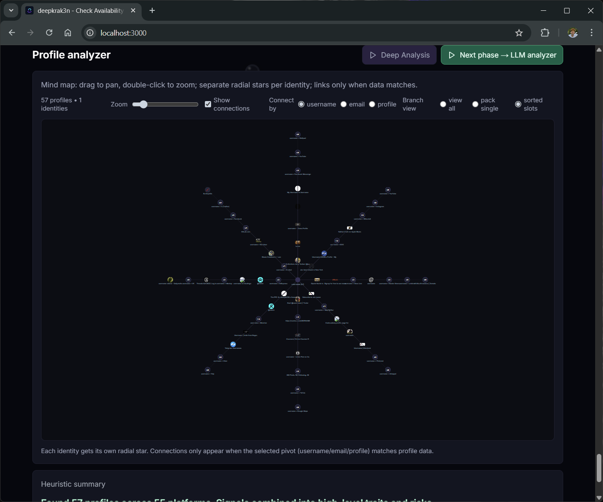
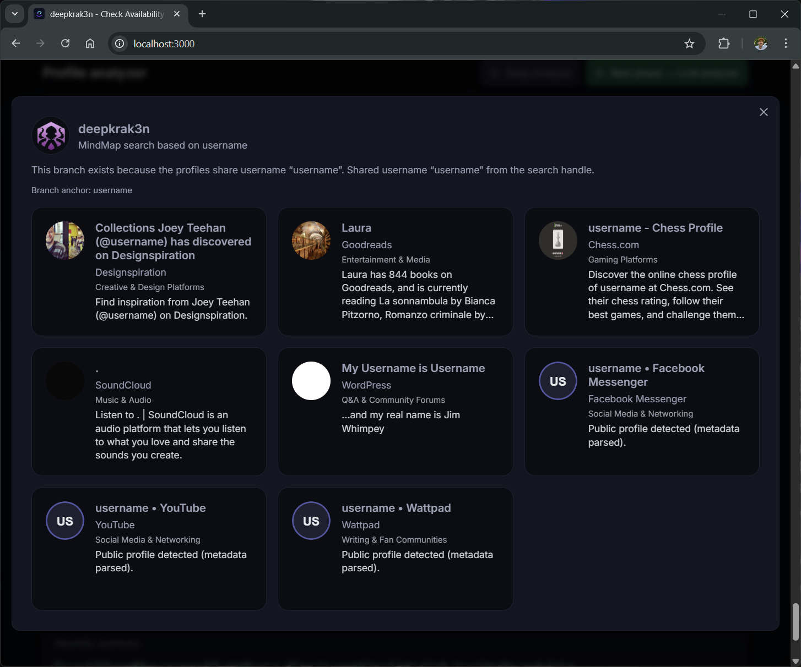
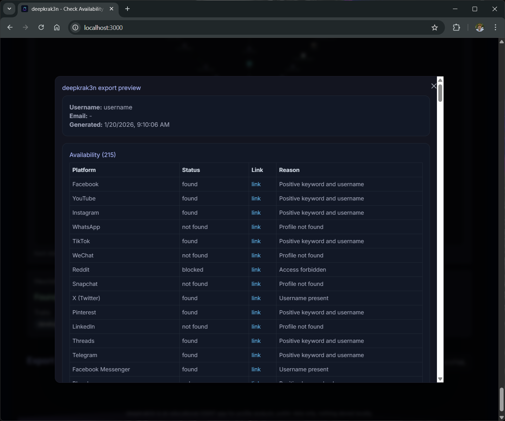

# deepkrak3n (v3) — OSINT Profile Analyzer

<p align="center">
  <a href="@guilhermelimait/deepkrak3n/files/deepkrak3nlogo.png" target="_blank">
    
  </a>
</p>

---

[](LICENSE)
[](https://osintframework.com/)
[](https://ollama.ai/)
[](https://github.com/guilhermelimait)
[)

---

## 📖 Table of Contents

1. [What is deepkrak3n?](#what-is-deepkrak3n)
2. [Features & Methods](#features--methods)
3. [Mindmapping & Visualization](#mindmapping--visualization)
4. [Search Techniques](#search-techniques)
5. [Improvements Over Original](#improvements-over-original)
6. [How to Run](#how-to-run)
7. [Configuration & Customization](#configuration--customization)
8. [Troubleshooting](#troubleshooting)
9. [Credits & License](#credits--license)

---

## What is deepkrak3n?

deepkrak3n is a **fully local, modern OSINT platform** for scanning and analyzing public profiles across **200+ platforms** by username or email. It provides more than just a list: it builds relationships between accounts, leverages AI for summary and risk analysis, and gives you a clean, fast, and private user experience. Developed for educational and research purposes, it respects privacy and runs with no external data storage.

---

## deepkrak3n images

<p align="center">
   
   <br>
   <br>
   
   <br>
   <br>
   
   <br>
   <br>
   
   <br>
   <br>
   
</p>

---

## Features & Methods

- **Wide Coverage:** Scan 200+ social media, forums, code repositories, streaming sites, and more.
- **Live Results:** Streaming scans show results as they are found—no need to wait for entire scan to finish.
- **Smart Profile Cards:** Each hit includes display name, bio, avatar, real-time status, and summaries.
- **AI/LLM Analysis:** Employs both classic heuristics and local/remote AI (Ollama, OpenAI, LLMs) for deep persona summaries, traits, and risk assessment.
- **Export & Sharing:** Securely export your findings as JSON or standalone HTML for further investigations or reporting.
- **Simple UX:** Minimalistic, modern interface (Next.js), dark mode, keyboard navigation, hot-reloading.
- **Privacy First:** No cached history, no account registration, everything runs on your machine.
- **Instant Filtering:** Results filter/search as you type, with highlight for risky/interesting hits.
- **Customizable Database:** Easily add or refine platform patterns in a single data file.
- **Batch Analysis:** Queue usernames/emails for multi-profile investigations.
- **Open Extensibility:** Backend and frontend can be used independently or extended with your logic.

---

## Mindmapping & Visualization

- **Relationship Mapping:** Links hits by username, email, or common profile features using interactive mindmaps.
- **Graph View:** Quickly see how accounts on different services are likely connected.
- **Overlap Analysis:** Highlights reused handles, similar emails, and related platform categories.
- **Pivot Insights:** Click a node to pivot and run a new search, or expand for more details.

---

## Search Techniques

- **Username & Email Scans:** Enter a handle or email. Results stream in as each platform is checked.
- **Heuristics:** Platform-specific and global rules determine “interesting” profiles and flag possible risks.
- **Pattern-matching:** Backend rapidly tests for presence, alternate spellings, name collisions, and more, using a unified platform regex DB.
- **LLM Persona Analysis:** Summarize an online identity across platforms with the power of AI—offline (Ollama) or API-powered (OpenAI).
- **Historical Hinting:** While no data is retained, you can manually compare export snapshots for changes over time.

---

## Improvements Over Original

- **Platform Database Expansion:** More than *double* the original supported platforms.
- **Modern Mindmapping:** New, intuitive interactive graph for visualizing results and overlaps.
- **Full AI Integration:** LLM-based cross-profile persona analysis, smart key trait, and risk extraction.
- **Performance:** Faster scanning/UI updates, less memory usage, improved concurrency.
- **Privacy & Simplicity:** All proxy code removed (unlike earlier versions), simplified setup, no dependencies outside your system unless you enable optional LLM.
- **Better Exports:** Exports now include full visuals and clean formatting for sharing, no PII or scan logs are stored.
- **Customizable Everything:** Both platform list and analyzer rules can be adjusted on-the-fly—no deeper changes required.
- **Accessibility:** Improved keyboard controls and screen reader compatibility.

---

## How to Run

**Requirements:**  
- Node.js v18+  
- Python 3.11+  
- (Optional for AI) Ollama or OpenAI-compatible key

**Steps:**

1. **Clone the Repo**
   ```sh
   git clone https://github.com/guilhermelimait/deepkrak3n.git
   cd deepkrak3n
   ```

2. **Backend**
   ```sh
   cd backend
   python -m venv .venv
   # Windows: .venv\Scripts\activate
   # macOS/Linux: source .venv/bin/activate
   pip install -r requirements.txt
   uvicorn app.main:app --host 0.0.0.0 --port 8000
   ```

3. **Frontend**
   ```sh
   cd ..
   npm install
   npm run dev
   # Visit http://localhost:3000
   ```

### Quick start (Windows)

- Double-click [start.bat](start.bat) or run it from PowerShell/CMD in the repo root. It will: create `.venv`, install backend deps, install npm packages, start uvicorn, then start Next.js on port 3000.

### Quick start (Linux/Codespaces)

1. Make the launcher executable once:
   ```bash
   chmod +x run.sh
   ```
2. Start both backend and frontend:
   ```bash
   ./run.sh
   ```
   - Backend logs: `/tmp/deepkrak3n-backend.log`
   - Frontend: http://localhost:3000 (exported via Codespaces port forwarding)

**Tip:**  
If your backend is not at `http://localhost:8000`, set env `NEXT_PUBLIC_API_BASE`.

---

## Configuration & Customization

- **Add/Remove Platforms:** Edit [`data/platforms.json`](data/platforms.json).
- **Switch AI Mode:** Ollama locally (`ollama pull smollm:latest`); OpenAI via API/key in settings.
- **Customize Analyzer:** Change profile prompt logic in Settings.
- **Themes & Layout:** Adjust via Tailwind config or settings panel.

---

## Troubleshooting

- Backend not responding? Check uvicorn/FastAPI is running and URL matches.
- AI errors? Confirm Ollama API is reachable, or OpenAI key is set and correct.
- Empty results or throttling? Some sites have aggressive rate limits—retry after a few minutes.

---

## Credits & License

- **Main contributor:** [guilhermelimait](https://github.com/guilhermelimait)
- **Original author:** [danm](https://github.com/danm)
- Community contributors — thank you!
- Open source under MIT License.

> *Educational use only. Respect privacy and Terms of all platforms. Your exports remain private unless you share them.*

---